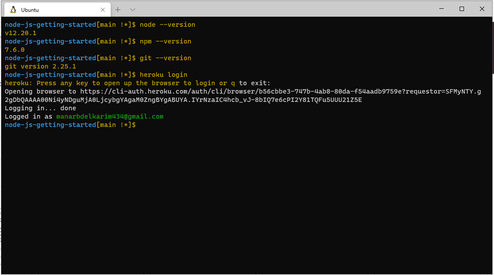

# Read: 05 - Heroku Deployment

### what is Heroku ?
Heroku is a cloud platform that lets companies build, deliver, monitor and scale apps — we're the fastest way to go from idea to URL, bypassing all those infrastructure headaches.

### what does Heroku do ?
Heroku lets you deploy, run and manage applications written in Ruby, Node.js, Java, Python, Clojure, Scala, Go and PHP.

### What is an application ?
An application is a collection of source code written in one of these languages, perhaps a framework, and some dependency description that instructs a build system as to which additional dependencies are needed in order to build and run the application.

##  Installation :

#### Node.js

 is an open source, cross-platform runtime environment, which allows you to build server-side and networking applications. It's written in JavaScript and can be run within the Node.js runtime on any platform. 