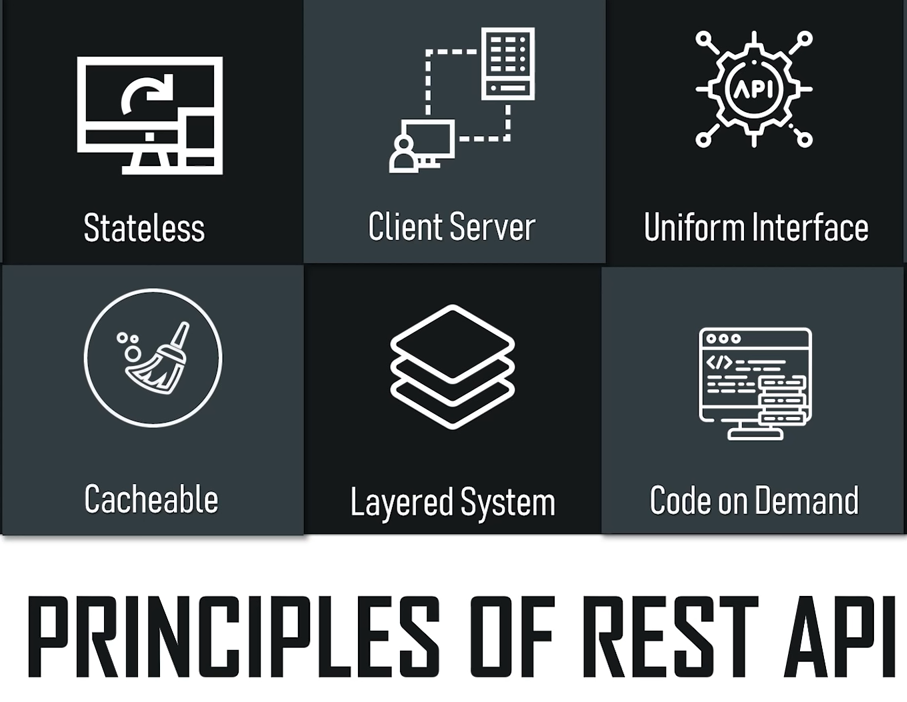
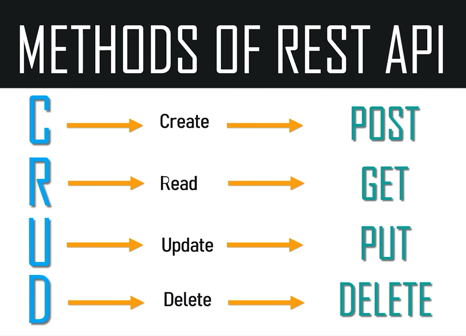

# Readings: REST
## REST

REST provides a definition of a “resource”, which is what those things point to.

 A web page is a “representation” of a resource. Resources are just concepts. URLs--those things that you type into the browser

 Those URLs tell the browser that there's a concept somewhere. A browser can then go ask for a specific representation of the concept. Specifically, the browser asks for the web page representation of the concept.

## REST API:

REST API makes an application more suitable for Internet
and is often regarded as the language of Internet and is completely based on resources apart from this it's also a stateless

client-server model that you can understand about so rest is really
simple guys it's just an architectural style as well as an approach for
communications purposes that is often used by various web services development
so now that you know what rest is let's look into the features of the REST API

so the features of REST API are as you can see on my screen it's more simpler than so it has a proper documentation and it gives you proper logging of error

## the principles of REST API

There are six clowned principles laid by dr. fielding who was to want to define the REST API design in 2000 so 

**the six count principles are stateless:**

- client-server 
- uniform interface 
- cashable layered 
- systems and code on demand so
- stateless 

## API methods :

