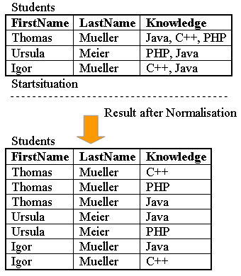
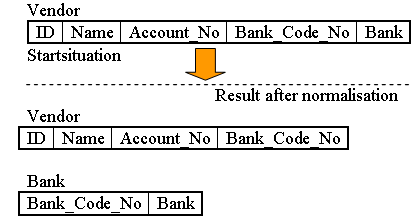

# Read: 14a - DB Normalization

### What is  Database normalization ?
 Database normalization is a process used to organize a database into tables and columns. The main idea with this is that a table should be about a specific topic and only supporting topics included. Take a spreadsheet containing the information as an example, where the data contains salespeople and customers serving several purposes:
  * Identify salespeople in your organization.
  * List all customers your company calls upon to sell a product.
  * Identify which salespeople call on specific customers.

 By limiting a table to one purpose you reduce the number of duplicate data contained within your database. This eliminates some issues stemming from database modifications.

### The Basic three normal forms :

There are three normal forms most databases adhere to using. As tables satisfy each successive database normalization form, they become less prone to database modification anomalies and more focused toward a sole purpose or topic.

### The modification anomalies that can occur:

1. Insert Anomaly: There are facts we cannot record until we know information for the entire row. 
2. Update Anomaly: In this case we have the same information in several rows. For instance if the office number changes, then there are multiple updates that need to be made.  If we don’t update all rows, then inconsistencies appear.
3. Deletion Anomaly: Deletion of a row causes removal of more than one set of facts.

### Having the table serve many purposes introduces many of the challenges:
  * Namely.
  * Data duplication.
  * Data update issues. 
  * Increased effort to query data.

### Reasons for Database Normalization
1. minimize duplicate data.
2. minimize or avoid data modification issues.
3. simplify queries. 

 **The forms are progressive, meaning that to qualify for 3rd normal form a table must first satisfy the rules for 2nd normal form, and 2nd normal form must adhere to those for 1st normal form.**

- **First Normal Form**

 – The information is stored in a relational table with each column containing atomic values. There are no repeating groups of columns.

- **Second Normal Form**

 – The table is in first normal form and all the columns depend on the table’s primary key.
Third Normal Form – the table is in second normal form and all of its columns are not transitively dependent on the primary key

- **Third Normal Form**

 

 – The table is in second normal form and all of its columns are not transitively dependent on the primary key
