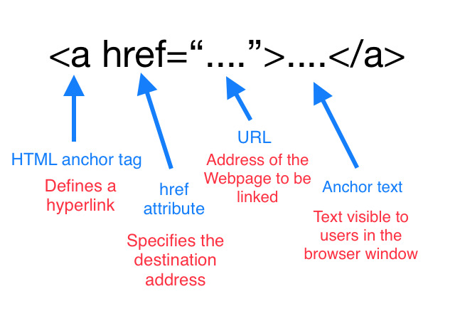
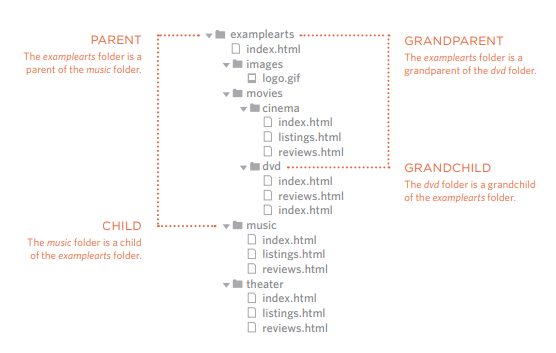
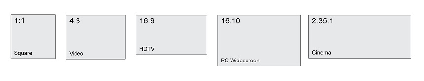
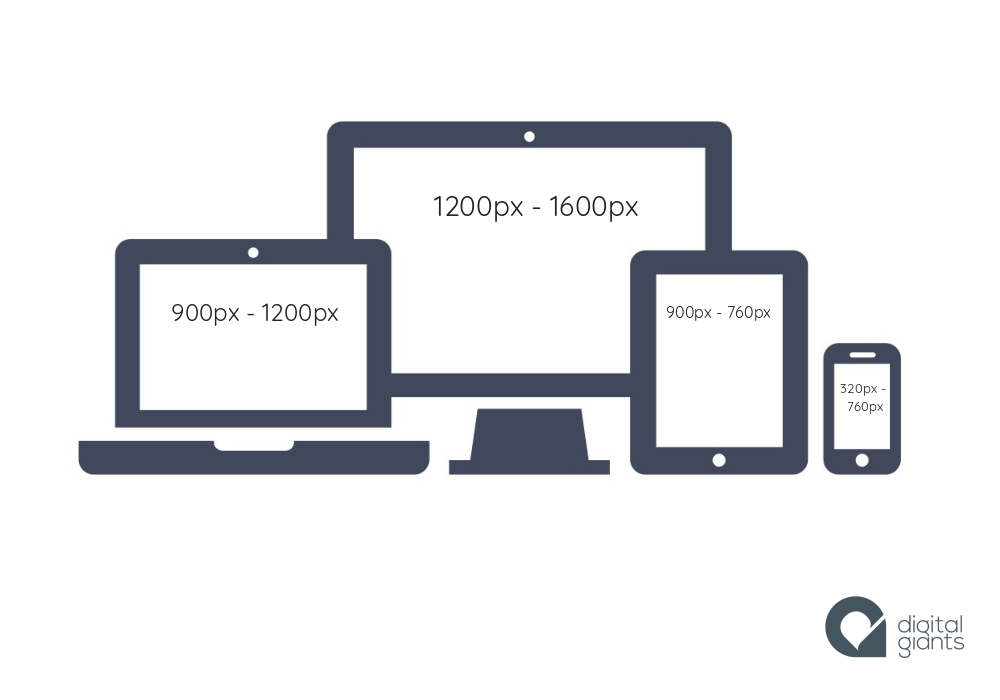

# Chapter 4: “Links” 
### what is a link in HTML ?
Links are the defining feature of the web
because they allow you to move from
one web page to another — enabling the
very idea of browsing or surfing

### How to write Links>
Links are created using the <a\> element. Users can click on anything
between the opening <a\> tag and the closing </a\> tag. You specify
which page you want to link to using the href attribute.
Writing Links

### What is <a\> tag?
 The <a\> tag defines a hyperlink, which is used to link from one page to another.<a\>indicate the link's destination. If the href attribute is present, pressing the enter key while focused on the <a\> element will activate it.

### Linking to Other Pages on the Same Site

- **absolute URL:**
When you link to a different
website, the value of the href
attribute will be the full web
address for the site, which is
known as an 

- **relative URL:** When you are linking to other
pages within the same site,
you do not need to specify the
domain name in the URL.

## Directory Structure
- Structure:

The directory structure is the organization of files into a hierarchy of folders.Computers have used the folder metaphor for decades as a way to help users keep track of where something can be found.

- Relationships

The relationship between
files and folders on a website
is described using the same
terminology as a family tree.The top-level folder is known
as the root folder. 

- Homepages

The main homepage of a site
written in HTML (and the
homepages of each section in a
child folder) is called index.html.

### Relative URLs

#### **what do we mean by Relative URLs?**
Relative URLs can be used when linking to pages within your own
website. They provide a shorthand way of telling the browser where to
find your files.

### Relative Link Type
- Same Folder:
    - ex (parentDir.png)
- Child Folder
    - ex (img/parentDir.png)
- Grandchild Folder
    - ex (reading-notes/img/parentDir.png)
- Parent Folder
    - ex (../parentDir.png)
- GrandParent Folder
    - ex (../../parentDir.png)

## Email Links

#### ***How to write an Email link ?***
<a\> tag provides you option to specify an email address to send an email. While using <a\> tag as an email tag, you will use mailto: email address along with href attribute.

#### ***What is mailto?***
Mailto link is a type of HTML link that activates the default mail client on the computer for sending an e-mail.

Example:   
        
                 <a href = "mailto: abc@example.com">
                 Send Email</a>

Result:

<a href = "mailto: abc@example.com">Send Email</a>

### Opening Links in a New Window

#### ***What is a target?***
The target attribute specifies a name or a keyword that indicates where to display the response that is received after submitting the form.

### Linking to a Specific Part of the Same Page

to link to a specific part in the same page you should use the id attribute og that part 

ex <a id="anchor-name"\>Section name</h2\>

### How to Link to a Specific Part of Another Page?

As long as the page you are
linking to has id attributes that
identify specific parts of the
page

ex <a href="http:abc@example.com/
#anchor-name"\>

## Summary
LINKS
- Links are created using the <a\> element.
- The <a\> element uses the href attribute to indicate
the page you are linking to.
- If you are linking to a page within your own site, it is
best to use relative links rather than qualified URLs.
- You can create links to open email programs with an
email address in the "to" field.
- You can use the id attribute to target elements within
a page that can be linked to.

# Chapter 15: “Layout” 

## Controlling the Position of Elements

### Normal Flow
#### ***What is Normal Flow?***
Normal flow is how the browser lays out HTML pages by default when you do nothing to control page layout. Elements on webpages lay themselves out according to normal flow - until we do something to change that.

### Flexbox Layout
#### ***What is Flexbox?***

Flexbox is a one-dimensional layout method for laying out items in rows or columns. Items flex to fill additional space and shrink to fit into smaller spaces. This article explains all the fundamentals.
### Grids Layout
#### ***What is Flexbox?***
 Flexbox is the short name for the Flexible Box Layout Module, it is a two-dimensional layout system for the web. 
 #### ***how to use Flexbox?***

 To use flexbox, you apply display: flex to the parent element of the elements you want to lay out

***Example:***

          

            
One

            
Two

            
Three

          

***The Result:***

  
One

  
Two

  
Three

### Floating Elements

 #### ***What is Float ?***

Floating an element changes the behavior of that element and the block level elements that follow it in normal flow. The element is moved to the left or right and removed from normal flow, and the surrounding content floats around the floated item.

<h3 style="color:red;">Note:</h3>
The floated element becomes a block-level element around which other
content can flow.

#### ***The float property values:***

- left 
- right 
- none 
- inherit  

***Example:***

        

        
Float Left

        
Float right

     
 Float inherit

        

***The Result:***

Float Left

Float right

 Float inherit

 

#### ***Clearing Floats***
- clear: left;
- clear: right;
- clear: both;

### Positioning

#### ***What does Positioning do?***

Positioning allows you to move an element from where it would be placed when in normal flow to another location. Positioning isn’t a method for creating your main page layouts

#### ***types of positioning:***

- **Static positioning** is the default that every element gets

- **Relative positioning** allows you to modify an element's position on the page,

      

      
hi

        
here another paragraph to see how it work 

      

hi

  
here another paragraph to see how it work 

 

- **Absolute positioning** moves an element completely out of the page's normal layout flow

      

      
hi there 

        
here another paragraph to see how it work 

      

- **Fixed positioning** is very similar to absolute positioning, except that it fixes an element relative to the browser viewport, not another element.

       

       
hi there 

         
that sticky "hi there" is the result XD 

       

 
## Screen Sizes
Different visitors to your site will have different sized screens that show
different amounts of information, so your design needs to be able to
work on a range of different sized screens.

## Screen Resolution
Resolution refers to the number of dots a screen shows per inch. Some
devices have a higher resolution than desktop computers and most
operating systems allow users to adjust the resolution of their screens.

## Page Sizes

Before smartphones and tablets became popular, web designers created fixed width pages that worked on the most common screen sizes - but now because screen sizes and display resolutions vary so much

# Chapter 3: “Functions, Methods, and Objects” 