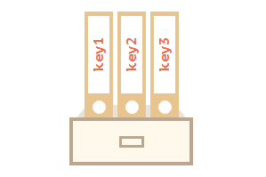
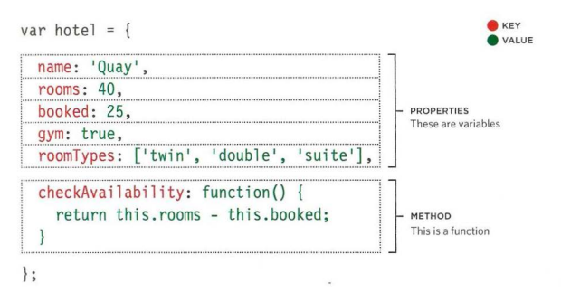
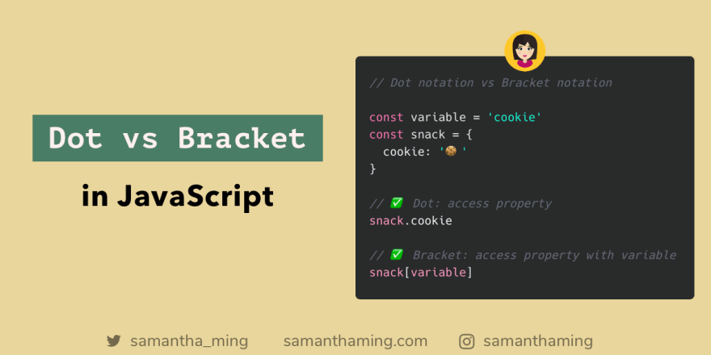

#  Problem Domain, Objects, and the DOM

## Chapter 3: “Object Literals” 
### WHAT IS AN OBJECT?

Objects group together a set of variables and functions to create a model
of a something you would recognize from the real world. In an object,
variables and functions take on new names. 

### property:
- in an object: variables become known as properties.
 - A property of an object can be explained as a variable that is attached to the object.
- The properties of an object define the characteristics of the object. 
- You access the properties of an object with a simple dot-notation:

        objectName.propertyName

- name and a value. In an object,
that name is called a key.

;

### usage of name/value pairs::

Programmers use a lot of name/value pairs:
- HTML uses attribute names and values.
- CSS uses property names and values.
In JavaScript:
- Variables have a name and you can assign them a
value of a string, number, or Boolean.
- Arrays have a name and a group of values. (Each
item in an array is a name/value pair because it
has an index number and a value.)
- Named functions have a name and value that is a
set of statements to run if the function is called.
- Objects consist of a set of name/value pairs
(but the names are referred to as keys). 

### Object Literal Notation:

- Literal notation is the easiest and most popular way to create objects. (There are several ways to create objects.)

- The Object literal notation is basically an array of key:value pairs, with a colon separating the keys and values, and a comma after every key:value pair, except for the last, just like a regular array. Values created with anonymous functions are methods of your object. Simple values are properties.

        var myObject ={
    	myProperty : value,
    	yourProperty : value,
    	myMethod : function(){
    	  //code here
    	},
    	yourMethod : function(){
    	  //more code
    	}
        }
### “this” in methods:
To access the object, a method can use the this keyword.
The value of this is the object “before dot”, the one used to call the method.

            const test = {
            prop: 42,
            func: function() {
              return this.prop;
             },
            };

            console.log(test.func());

**output: 42**

### Accessing an object:
 you can a proparity of an  object using:
 - dot 
- square brackets

## Summary :

- An object is a series of variables and functions that
represent something from the world around you.
- In an object, variables are known as properties of the
object; functions are known as methods of the object. 

## Chapter 5: “Document Object Model”

### What is The Document Object Model ?
The Document Object Model (DOM) specifies
how browsers should create a model of an HTML
page and how JavaScript can access and update the
contents of a web page while it is in the browser window. 

### what is dom tree?
The dom tree is a model of a web page as a browser As a browser loads a web page, it creates a model of that page. The model is called a DOM tree, and it is stored in the browsers' memory.
It consists of four main types of nodes :

1. the document node 
2. element node
3. attribute nodes 
4. text nodes 

 
 You can get element from the the method by get element you can also loop over nodelist and apply the same 
statement to each .TRAVERSING THE DOM When you have an element node, you can select another element in relation to it using these five properties. This is known as traversing the DOM. 

### ATTRIBUTE NODES
The opening tags of HTML elements can carry
attributes and these are represented by attribute
nodes in the DOM tree. 

### TEXT NODES
Once you have accessed an element node, you
can then reach the text within that element. This is
stored in its own text node. 

## SUMMARY 
DOCUMENT OBJECT MODEL 

- The browser represents the page using a DOM tree. DOM trees have four types of nodes: document nodes, element nodes, attribute nodes, and text nodes. 
- You can select element nodes by their id or class attributes, by tag name, or using CSS selector syntax. 
- Whenever a DOM query can return more than one node, it will always return a NodeList. 
- From an element node, you can access and update its content using properties such as textContent and innerHTML or using DOM manipulation techniques. An element node can contain multiple text nodes and child elements that are siblings of each other. 
- In older browsers, implementation of the DOM is inconsistent (and is a popular reason for using jQuery). 
- Browsers offer tools for viewing the DOM tree.