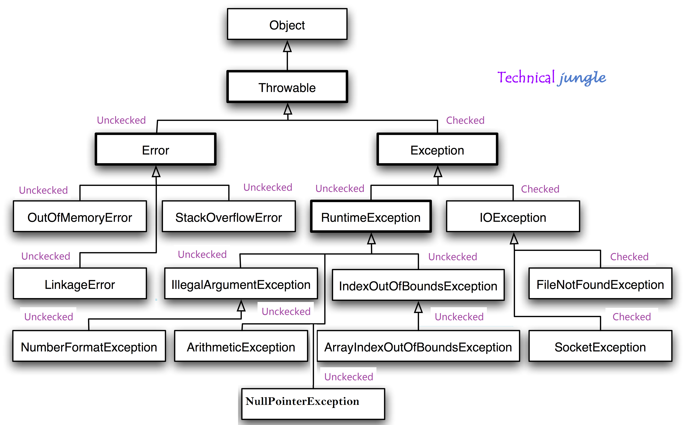

# Debugging

- to learn how to solve programming errors we should know about :
1. THE CONSOLE & DEV TOOLS
     - Tools built into the browser
that help you hunt for errors. 
2. COMMON PROBLEMS
    - Common sources of errors,
and how to solve them.
3. HANDLING ERRORS
    - How code can deal with potential errors gracefully. 

### ORDER OF EXECUTION :
To find the source of an error, it helps to know how scripts are processed.
The order in which statements are executed can be complex; some tasks
cannot complete until another statement or function has been run.

### EXECUTION CONTEXTS
The JavaScript interpreter uses the concept of execution contexts.
There is one global execution context; plus, each function creates a new
new execution context. They correspond to variable scope. 

### THE STACK
 The JavaScript interpreter processes one line of code at a time. When a statement needs data from another function, it stacks (or piles) the new function on top of the current task.

 ### EXECUTION CONTEXT & HOISTING
 Each time a script enters a new execution context, there are two phases
of activity: 

1. PREPARE

-  The new scope is created

-  Variables, functions, and arguments are created

- The value of the this keyword is determined

2. EXECUTE
- Now it can assign values to variables
- Reference functions and run their code
- Execute statements 

###  hoisting
The preparation phase is often described as taking
all of the variables and functions and hoisting them
to the top of the execution context. 

## UNDERSTANDING SCOPE 

 ### lexical scope:
 Functions in JavaScript are said to have lexical scope.
They are linked to the object they were defined within.
So, for each execution context, the scope is the
current execution context's variables object, plus the
variables object for each parent execution context.

## UNDERSTANDING ERRORS

### exception:
If a JavaScript statement generates an error, then it throws an exception.
At that point, the interpreter stops and looks for exception-handl ing code. 

### ERROR OBJECTS:
Error objects can help you find where your mistakes are
and browsers have tools to help you read them. 

When an Er ror object is created, it will contain the
following properties:
- PROPERTY DESCRIPTION
- name Type of execution
- message Description
- file eNumber Name of the JavaScript file
- line neNumber Line number of error 

### Error object types:
- Eval Error

INCORRECT USE OF eval() FUNCTION
The eval () function evaluates text through the
interpreter and runs it as code.

- URI Error

INCORRECT USE OF URI FUNCTIONS
If these characters are not escaped in URls, they will
cause an error: / ? & I : ;

- Type Error

VALUE IS UNEXPECTED DATA TYPE
This is often caused by trying to use an object or
method that does not exist. 

- RangeError
NUMBER OUTSIDE OF RANGE
If you call a function using numbers outside of its
accepted range. 

**Note**:

NaN
NOT AN ERROR! If you perform a mathematical operation using
a value that is not a number, you end up with the
value of NaN, not a type error.
NOT A NUMBER

## HOW TO DEAL WITH ERRORS

1. DEBUG THE SCRIPT TO FIX ERRORS:

    -  you will need to debug the code, track down the source of the error,
and fix it.

2. HANDLE ERRORS GRACEFULLY:

    - You can handle errors gracefully using try, catch,
throw, and f i na 1 ly statements. 

### A DEBUGGING WORKFLOW :
Debugging is about deduction: eliminating potential causes of an error.

### BREAKPOINTS:
You can pause the execution of a script on any
line using breakpoints. Then you can check the
values stored in variables at that point in time. 
### CONDITIONAL BREAKPOINTS
You can indicate that a breakpoint should be
triggered only if a condition that you specify is
met. The condition can use existing variables. 

### DEBUGGER KEYWORD:
You can create a breakpoint
in your code using just the
debugger keyword

## HANDLING EXCEPTIONS 

- TRY

    - First, you specify the code
    that you think might throw an
    exception within the try block.

- CATCH
        
    - If the try code block throws an
        exception, catch steps in with an
        alternative set of code. 

- FINALLY

     - The contents of the fina11y
code block will run either
way - whether the try block
succeeded or failed. 

### THROWING ERRORS
 you can
generate your own errors before the interpreter creates them. 

## SUMMARY
 - ERROR HANDLING & DEBUGGING If you understand execution contexts (which have two stages) and stacks, you are more likely to find the error in your code.

- Debugging is the process of finding errors. It involves a process of deduction.

- The console helps narrow down the area in which the error is located, so you can try to find the exact error.

 - JavaScript has 7 different types of errors. Each creates its own error object, which can tell you its line number and gives a description of the error.
 
 - If you know that you may get an error you can handle it gracefully using the try, catch, finally statements. Use them to give your users helpful feedback.