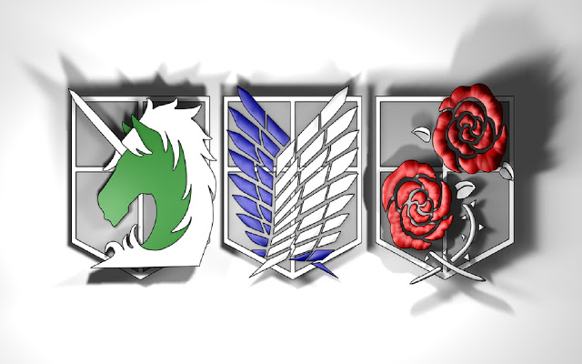

## HTML5 video and audio

## Chapter 16: “Images


CSS Setting height and width for images the height and width properties are used to set the height and width of an element.

The `height` and `width` properties do not include padding, borders, or margins. It sets the height/width of the area inside the padding, border, and margin of the element.

Specifying image sizes helps
pages to load more smoothly
because the HTML and CSS
code will often load before the
images, and telling the browser
how much space to leave for an
image allows it to render the rest
of the page without waiting for
the image to download.


```
img {
height: 200px;
width: 50%;
}
<html>
```
<style>
img {
height: 300px;
width: 100%;
}</style>

<html>

The <video\> and <audio\> elements allow us to embed video and audio into web pages. As we showed in Video and audio content, a typical implementation looks like this:
```
<video controls>
  <source src="rabbit320.mp4" type="video/mp4">
  <source src="rabbit320.webm" type="video/webm">
  <p>Your browser doesn't support HTML5 video. Here is a <a href="rabbit320.mp4">link to the video</a> instead.</p>
</video>
```

<video controls>
  <source src="rabbit320.mp4" type="video/mp4">
  <source src="rabbit320.webm" type="video/webm">
  <p>Your browser doesn't support HTML5 video. Here is a <a href="rabbit320.mp4">link to the video</a> instead.</p>
</video>

This creates a video player inside the browser.

**How to align images?**

.column {
float: left;
width: 33.33%;
padding: 5px;
}

.row::after {
content: "";
clear: both;
display: table;
}


**background-image**

The `background-image` property specifies an image to use as the background of an element. 
<br>
The background-image
property allows you to place
an image behind any HTML
element. This could be the entire
page or just part of the page. By
default, a background image will
repeat to fill the entire box.<br>
and you can control how many times
you want to repeat in the x direction 
or the y direction or none for not repeating 
once ,or you can assign background postion
Using CSS, it is possible to create
a link or button that changes to a
second style when a user moves
their mouse over it (known as a
rollover) and a third style when
they click on it.
<br> To reduce the number 
of images your browser has to
load, you can create image sprites.

**Repeating Images**

- repeat  
- repeat-x 
- repeat-y 
- no-repeat 


**Example**
body {
  background-image: url("./img/teamAttack.jpg");
  background-repeat: repeat-y;
}
<br>
result at the end of the summary 

**position of background image**


**Add Responsiveness**

Optionally, you could add media queries to make the images stack on top of each other instead of floating next to each other, on a specific screen width.

## Summary
IMAGES
- You can specify the dimensions of images using CSS.
This is very helpful when you use the same sized
images on several pages of your site.

- Images can be aligned both horizontally and vertically
using CSS.
- You can use a background image behind the box
created by any element on a page.
- Background images can appear just once or be
repeated across the background of the box.
- You can create image rollover effects by moving the
background position of an image.
- To reduce the number of images your browser has to
load, you can create image sprites.


## Chapter 19: “Practical Information”


**Search Engine Optimization (SEO)**

Search engine optimization (or
SEO) is the practice of trying
to help your site appear nearer
the top of search engine results
when people look for the topics
that your website covers.

**(the words people might search on to find your site) can appear in order to improve its findability:**
1. Page title
2. URL / Web Address
3. Headings
4. Text
5. Link text
6. image ALT text 
7. Page descriptions


## Summary
PRACTICAL INFORMATION
- Search engine optimization helps visitors find your
sites when using search engines.

- Analytics tools such as Google Analytics allow you to
see how many people visit your site, how they find it,
and what they do when they get there.
- To put your site on the web, you will need to obtain a
domain name and web hosting.
- FTP programs allow you to transfer files from your
local computer to your web server.
- Many companies provide platforms for blogging, email
newsletters, e-commerce and other popular website
tools (to save you writing them from scratch).

<style>
#test {
  background-image: url("./img/teamAttack.jpg");
  background-repeat: repeat-y;
  background-position:center;
  background-size:10%;
}
</style>
<html>
<div id='test' style="height: 100px">
</body>
</html>

<br><br><br><br><br>
