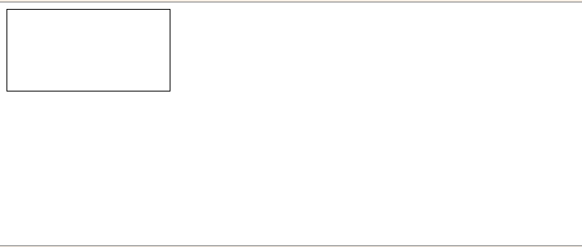
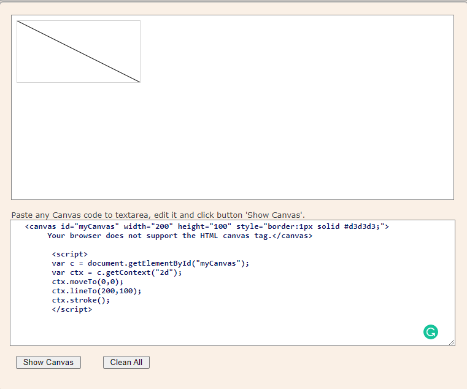
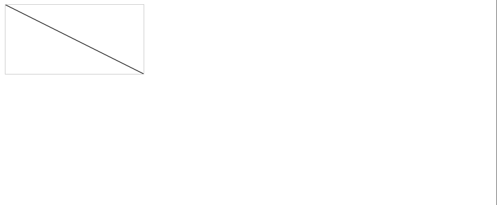
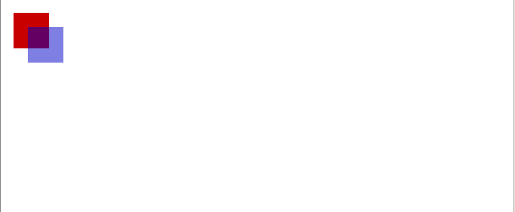
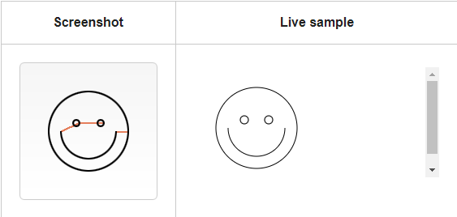
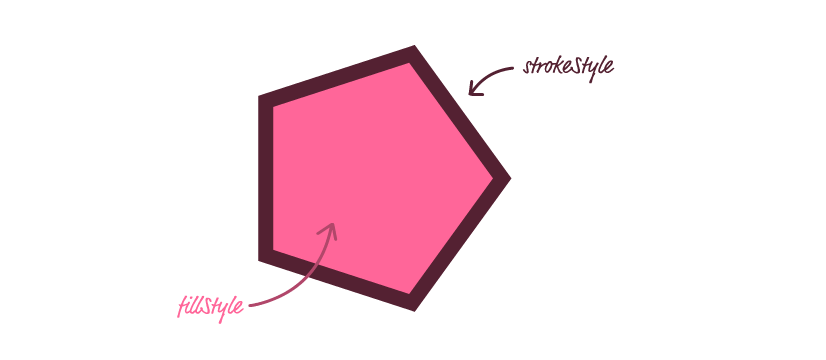
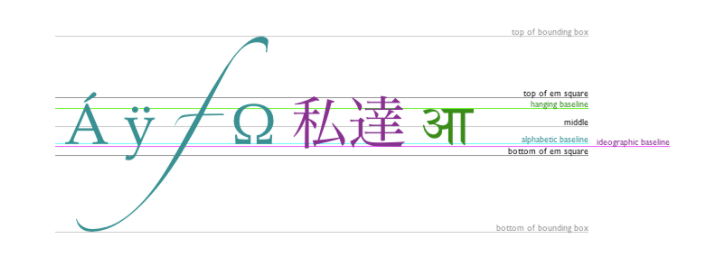

# Chart.js, Canvas 

## Canvas:
The HTML <canvas\> element is used to draw graphics on a web page.

The graphic to the left is created with <canvas\>. It shows four elements: a red rectangle, a gradient rectangle, a multicolor rectangle, and a multicolor text.


## what is canvas element ?
The <canvas\> element is only a container for graphics. You must use JavaScript to actually draw the graphics.

Canvas has several methods for drawing paths, boxes, circles, text, and adding images.

**example**

         <canvas id="myCanvas" width="200" height="100" style="border:1px solid #000000;">
       </canvas>


***`result:`***



### Required </canvas\> tag:
 unlike the  element, the <canvas\> element requires the closing tag (</canvas\>). If this tag is not present, the rest of the document would be considered the fallback content and wouldn't be displayed.

 ## The rendering context:
 The canvas is initially blank. To display something, a script first needs to access the rendering context and draw on it. The <canvas\> element has a method called getContext(). getContext() takes one parameter, the type of context.

 Example:




### result:




       
       
            function draw() {
              var canvas = document.getElementById('canvas');
              if (canvas.getContext) {
                var ctx = canvas.getContext('2d');
        
                ctx.fillStyle = 'rgb(200, 0, 0)';
                ctx.fillRect(10, 10, 50, 50);
        
                ctx.fillStyle = 'reba(0, 0, 200, 0.5)';
                ctx.fillRect(30, 30, 50, 50);
              }
            }
         <body onload="draw();"\>
           <canvas id="canvas" width="150" height="150"\></canvas\>
   


result:



## The grid:
grid or coordinate space, The origin of this grid is positioned in the top left corner at coordinate (0,0). All elements are placed relative to this origin. So the position of the top left corner of the blue square becomes x pixels from the left and y pixels from the top, at coordinate (x,y)


## Drawing rectangles:
Each of these three functions takes the same parameters. x and y specify the position on the canvas (relative to the origin) of the top-left corner of the rectangle. width and height provide the rectangle's size.

- fillRect(x, y, width, height)
     - Draws a filled rectangle.
- strokeRect(x, y, width, height)
     - Draws a rectangular outline.
- clearRect(x, y, width, height)
    - Clears the specified rectangular area, making it fully transparent.

    ## Drawing paths:

- beginPath()
    - Creates a new path. Once created, future drawing commands are directed into the path and used to build the path up.
- Path methods
    -  Methods to set different paths for objects.
- closePath()
    - Adds a straight line to the path, going to the start of the current sub-path.
- stroke()
    - Draws the shape by stroking its outline.
- fill()
    - Draws a solid shape by filling the path's content area.

## Moving the pen

- moveTo(x, y)
     - Moves the pen to the coordinates specified by x and y.

     Example:


         function draw() {
        var canvas = document.getElementById('canvas');
         (canvas.getContext) {
         var ctx = canvas.getContext('2d');
        
        ctx.beginPath();
        ctx.arc(75, 75, 50, 0, Math.PI * 2, true); // Outer circle
        ctx.moveTo(110, 75);
        ctx.arc(75, 75, 35, 0, Math.PI, false);  // Mouth (clockwise)
        ctx.moveTo(65, 65);
        ctx.arc(60, 65, 5, 0, Math.PI * 2, true);  // Left eye
        ctx.moveTo(95, 65);
        ctx.arc(90, 65, 5, 0, Math.PI * 2, true);  // Right eye
        ctx.stroke();

```result```:


        

## Lines
For drawing straight lines, use the lineTo() method.

- lineTo(x, y)
    - Draws a line from the current drawing position to the position specified by x and y.


 ## Arcs
To draw arcs or circles, we use the arc() or arcTo() methods.
Draws an arc which is centered at (x, y) position with radius r starting at startAngle and ending at endAngle going in the given direction indicated by anticlockwise (defaulting to clockwise).

        arc(x, y, radius, startAngle, endAngle, anticlockwise)

Draws an arc with the given control points and radius, connected to the previous point by a straight line.

        arcTo(x1, y1, x2, y2, radius)

## Colors:

- fillStyle = color
    - Sets the style used when filling shapes.
- strokeStyle = color
    - Sets the style for shapes' outlines.



## Line styles
There are several properties which allow us to style lines.

- lineWidth = value
    - Sets the width of lines drawn in the future.
- lineCap = type
    - Sets the appearance of the ends of lines.
- lineJoin = type
    - Sets the appearance of the "corners" where lines meet.
- miterLimit = value
    - Establishes a limit on the miter when two lines join at a sharp angle, to let you control how thick the junction becomes.
- getLineDash()
    - Returns the current line dash pattern array containing an even number of non-negative numbers.
- setLineDash(segments)
    - Sets the current line dash pattern.
- lineDashOffset = value
    - Specifies where to start a dash array on a line.

## Drawing text
The canvas rendering context provides two methods to render text:

- fillText(text, x, y [, maxWidth])
    - Fills a given text at the given (x,y) position. Optionally with a maximum width to draw.
- strokeText(text, x, y [, maxWidth])
    - Strokes a given text at the given (x,y) position. Optionally with a maximum width to draw.

## Styling text

- font = value
    - The current text style being used when drawing text. This string uses the same syntax as the CSS font property. The default font is 10px sans-serif.
- textAlign = value
    - Text alignment setting. Possible values: start, end, left, right or center. The default value is start.
- textBaseline = value
    - Baseline alignment setting. Possible values: top, hanging, middle, alphabetic, ideographic, bottom. The default value is alphabetic.
- direction = value
    - Directionality. Possible values: ltr, rtl, inherit. The default value is inherit.


## Chart.js
Charts are far better for displaying data visually than tables and have the added benefit that no one is ever going to press-gang them into use as a layout tool. They’re easier to look at and convey data quickly, but they’re not always easy to create.

A great way to get started with charts is with Chart.js, a JavaScript plugin that uses HTML5’s canvas element to draw the graph onto the page. It’s a well documented plugin that makes using all kinds of bar charts, line charts, pie charts and more, incredibly easy.

**Drawing a bar chart**
```
<canvas id="income" width="600" height="400"></canvas>
var income = document.getElementById("income").getContext("2d");
new Chart(income).Bar(barData);
var barData = {
	labels : ["January","February","March","April","May","June"],
	datasets : [
		{
			fillColor : "#48A497",
			strokeColor : "#48A4D1",
			data : [456,479,324,569,702,600]
		},
		{
			fillColor : "rgba(73,188,170,0.4)",
			strokeColor : "rgba(72,174,209,0.4)",
			data : [364,504,605,400,345,320]
		}

	]
}
